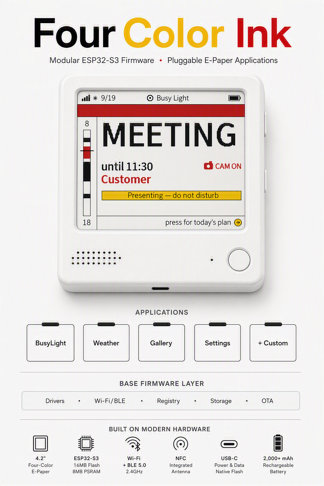

# FourColor Ink

This is an ESP32-S3 four-color e-ink device firmware project. The mainline consists
of two parts: the ESP32 firmware itself, and a small Python bridge script under
`server/` that feeds it presence/calendar data over HTTP — required for the
busy-light module to show real data (the firmware still builds and runs
without it, but busy-light has nothing to display).

The firmware is organized into modules, each an independent page reachable from
the quick-switch menu: a busy-light indicator (backed by the presence/calendar
bridge), a photo gallery (with AP/LAN photo transfer), a weather page, and a
settings page. A handful of unfinished experiments (chat, ebook reader, news,
calendar) live under `firmware/experiments/` — see
[`firmware/experiments/README.md`](firmware/experiments/README.md) — excluded
from the build until someone picks them back up.

## Architecture



Applications (BusyLight, Weather, Gallery, Settings, and any future modules)
plug into a shared base firmware layer (drivers, Wi-Fi/BLE, module registry,
storage, OTA) running on the ESP32-S3 hardware.

## Photo Transfer

Album images reach the device either over the AP photo-transfer hotspot the
firmware itself hosts, or over the LAN photo-push HTTP API the firmware
exposes once LAN service is enabled (see
[`docs/LAN_PHOTO_PUSH_API.md`](docs/LAN_PHOTO_PUSH_API.md)) — both are served
directly by the ESP32, there is no PC/server-side image service. Images are
converted to `2BP BWRY` (black, white, red, yellow) before being written to
the four-color e-ink screen.

## Current Status

- There is no LLM/voice/chat backend in this repo. `server/` only contains
  small, optional bridge scripts (presence/calendar) and a few local dev/debug
  tools — see [Presence/Calendar Bridge](#presencecalendar-bridge-busy-light)
  below.
- The firmware's main UI is rendered with RawDraw, designed by default for four-color screens, while still keeping 1bpp black/white compatibility.
- Themes currently keep a single default visual direction: a Nintendo-esque four-color theme, emphasizing the semantic use of red, yellow, black, and white.
- Image transfer supports both 1bpp black/white and 2bpp four-color BWRY formats.
- The root `.gitignore` excludes build artifacts, logs, pid files, databases, local config, and secret files.

## Directory Structure

```text
.
├── firmware/            ESP32-IDF firmware: RawDraw UI, page/module rendering, screen drivers,
│                        AP + LAN photo transfer, and firmware/scripts/ build tooling
├── firmware/experiments/ Unfinished modules kept for reference, excluded from the build
├── server/              Optional Python bridge scripts (presence/calendar) + local dev tools
└── docs/                Design docs and implementation notes (e.g. the LAN photo push API)
```

## Presence/Calendar Bridge (Busy Light)

The busy-light page polls a small HTTP bridge for `GET /live` (presence)
and `GET /calendar/today` (calendar) - see `server/calendar_bridge.py` or
`server/presence_bridge.py` for the two implementations (webhook+HA vs.
all-HA) and `server/.env.example` for the full list of configuration
variables. Point the firmware at it via the `PRESENCE_BRIDGE_ENDPOINT`
Kconfig option (`idf.py menuconfig` > Xiaozhi Assistant > Deployment
defaults).

Run it directly:

```bash
cd server
cp .env.example .env   # fill in real values
python3 calendar_bridge.py --port 8080
```

Or as a container (no third-party Python dependencies, so the image is
just a slim Python base + the two bridge scripts):

```bash
cd server
cp .env.example .env   # fill in real values
docker compose up -d --build
```

A prebuilt image is also published to `ghcr.io/<owner>/busylight-bridge`
on every change under `server/` (see
`.github/workflows/build-bridge.yml`); swap `docker-compose.yml`'s
`build:` line for `image: ghcr.io/<owner>/busylight-bridge:<version>` to
use that instead of building locally. There's no version file to bump by
hand: the published version is computed automatically from [Conventional
Commits](#commit-messages) touching `server/` since the last `bridge-v*`
git tag (`feat:` -> minor, `fix:`/`perf:` -> patch, a `!:` marker or
`BREAKING CHANGE:` footer -> major).

Every config variable also supports the standard `<VAR>_FILE` Docker/
Kubernetes secrets convention (e.g. `HA_TOKEN_FILE=/run/secrets/ha_token`)
as an alternative to putting the raw secret in `.env` - see the commented
`secrets:` example in `server/docker-compose.yml`.

## Other `server/` Scripts

Besides `calendar_bridge.py`/`presence_bridge.py`, `server/` has a few local
dev/debug helpers, none of which need to run for normal device operation:

- `mock_presence_server.py` — a fake `/live`+`/calendar/today` HTTP server for
  exercising the busy-light page without real Home Assistant/calendar
  credentials.
- `press_button.py`, `screenshot.py` — local hardware test helpers.
- `mock_client.py` — a WebSocket client for a voice/LLM/TTS backend that no
  longer exists in this repo (it was written against an old `llmserve.py`
  service). It's only useful again if the `chat` experiment (see
  `firmware/experiments/README.md`) is revived along with a real backend to
  match it.

## Photo and Device Management

There is no PC-side image server. Photos reach the device one of two ways,
both served directly by the firmware:

- **AP photo transfer**: the device hosts a Wi-Fi AP (`InkScreen-AP`) and an
  HTTP upload page at `http://192.168.4.1` while transfer mode is active
  (triggered from the Gallery page, see [Button Controls](#button-controls)).
- **LAN photo push**: once the device is on your Wi-Fi and "LAN Service" is
  enabled in Settings, it exposes an `/upload` HTTP API on its LAN IP for a
  NAS/script to push pre-converted `1bpp`/`2bpp` image data on a schedule —
  fully documented in [`docs/LAN_PHOTO_PUSH_API.md`](docs/LAN_PHOTO_PUSH_API.md).

## Firmware

The firmware lives in `firmware/`, based on ESP-IDF. It targets the ZecTrix ESP32-S3 4.2" e-ink screen by default, supporting the four-color BWRY screen while also keeping a 1bpp black/white screen configuration.

### Build (Windows / PowerShell)

Install ESP-IDF v6.0 first via the [IDF installation manager (idf-im-ui)](https://github.com/espressif/idf-im-ui)
if it isn't already set up; it creates the `Microsoft.v6.0.PowerShell_profile.ps1` environment
script referenced below (default install path: `C:\Espressif\tools\`).

This project is built on Windows using the ESP-IDF PowerShell environment (not Git Bash — the
ESP-IDF tooling breaks under `MSYSTEM=MINGW64`):

```powershell
Remove-Item Env:MSYSTEM -ErrorAction SilentlyContinue
. 'C:\Espressif\tools\Microsoft.v6.0.PowerShell_profile.ps1'
cd firmware
idf.py build
```

Flash (device attached, e.g. on `COM9`):

```powershell
idf.py -p COM9 flash
```

One-time setup for a fresh git worktree/clone (`firmware/sdkconfig` is gitignored, so a new
checkout defaults to the wrong chip target):

```powershell
idf.py set-target esp32s3
```

Gotcha worth remembering: clearing `Env:MSYSTEM` first is mandatory — without it, `idf.py build`
silently no-ops with exit code 0 and never actually compiles anything.

### Build (Linux / macOS)

```bash
cd firmware
source ~/Documents/esp/v6.0/esp-idf/export.sh
idf.py build
```

### Screen Configuration

The firmware Kconfig has a screen type selection:

```text
ZECTRIX_EPD_PANEL_4COLOR_SSD2683  Four-color BWRY screen
ZECTRIX_EPD_PANEL_1BPP            Black/white 1bpp screen
```

To flash back to the old black/white screen, switch to `1bpp black/white EPD` in `idf.py menuconfig` first, then rebuild and reflash. The RawDraw theme layer will downgrade red/yellow semantic colors to a black/white-readable style.

## UI Overview

The firmware UI runs on the RawDraw component system (`RawDrawUiManager`),
where each page is one module. Current modules reachable via the
quick-switch menu:

- **BusyLight**: presence/calendar status (see the bridge section above).
- **Weather**: current conditions + 3-day forecast + a rain/snow/wind/heat
  alert bar, backed by OpenWeatherMap One Call 3.0 — see
  [`docs/weather.md`](docs/weather.md).
- **Gallery**: photo thumbnails, full-image view (PhotoDetail), and the AP/LAN
  photo-transfer entry points.
- **Settings**: volume, brightness, network, LAN service toggle, etc.

Also present but not in the quick-switch (debug/setup only):

- **Wifi** / **APTransfer**: shown automatically during Wi-Fi config / AP
  photo-transfer flows, not user-selectable pages.
- **FontDebug** / **FontMetrics**: hardware alignment/calibration pages, kept
  for debugging font rendering.

Unfinished modules (chat, ebook, news, calendar) are parked outside the
build under `firmware/experiments/` — see
[`firmware/experiments/README.md`](firmware/experiments/README.md) for what
each one is and what it'd take to revive it.

The four-color screen theme layer draws components via semantic styles; adding bare `RED/YELLOW/BLACK/WHITE` directly in business pages is discouraged. Prefer RawDraw components and theme tokens when adding new UI.

### Button Controls

The device has three physical buttons: UP, DOWN, and BOOT/CONFIRM.

| Button | Click | Long press | Double-click |
| --- | --- | --- | --- |
| UP | Context-sensitive (menu-up / previous item) | Only acts if already on Settings: exits back to Gallery | Opens/closes the quick-switch menu |
| DOWN | Context-sensitive (menu-down / next item) | Opens Settings (from any page) | Not wired to anything |
| BOOT/CONFIRM | Confirm/select (e.g. picks the highlighted quick-switch item) | Context-sensitive: exits WiFi-config-AP mode if active, else exits AP photo-transfer mode if running, else starts AP photo-transfer mode from Gallery | Reserved globally for debug screenshot capture (no hardware handler currently triggers it) |

UP + DOWN held together (long press) enters WiFi config mode (starts the device's config AP).

Note UP long-press does **not** open Settings — only DOWN long-press does. UP long-press only ever *exits* Settings back to Gallery, and is a no-op on every other page.

## Environment Variables

Presence/calendar bridge configuration lives entirely in `server/.env`
(copied from `server/.env.example`) — see the
[Presence/Calendar Bridge](#presencecalendar-bridge-busy-light) section
above for the variable list. On the firmware side, `PRESENCE_BRIDGE_ENDPOINT`
is a Kconfig option (`idf.py menuconfig`), not an environment variable.

Do not commit `.env`, databases, logs, pid files, build directories, or firmware artifacts.

## Git Commit Scope

Recommended to commit:

- Firmware source such as `firmware/main/`, `firmware/components/`, `firmware/partitions/`.
- `server/*.py`, `server/docker-compose.yml`, `server/Dockerfile`, `server/.env.example`.
- Root README, docs, config templates.

Do not commit:

- `firmware/build/`
- `firmware/managed_components/`
- `firmware/sdkconfig`
- `firmware/releases/`
- `server/.env`
- `server/*.pid`
- `server/*.log`
