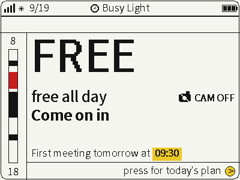
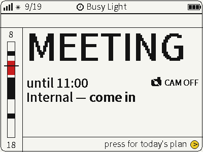
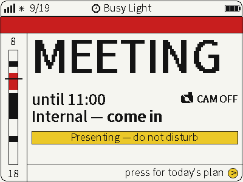
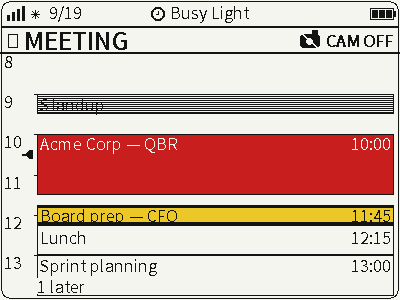
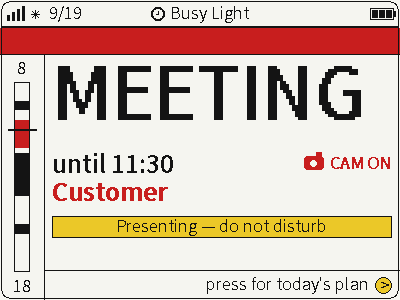
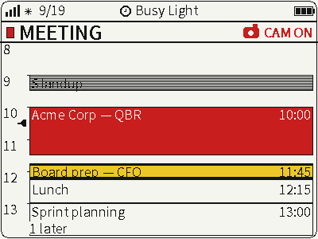
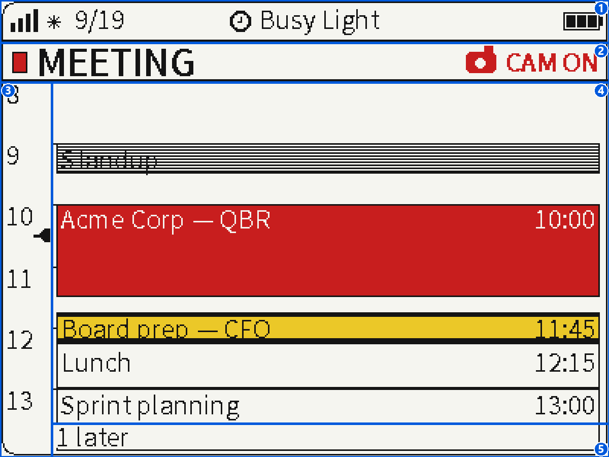
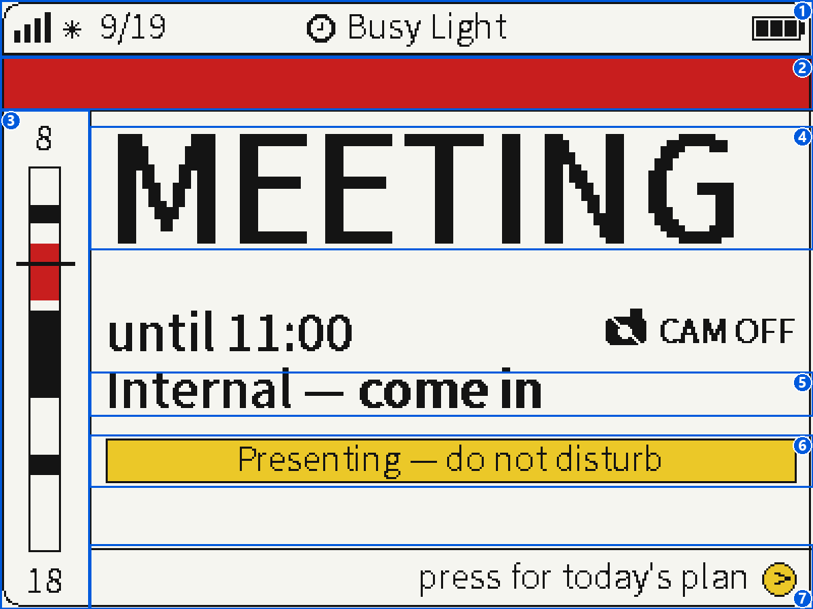
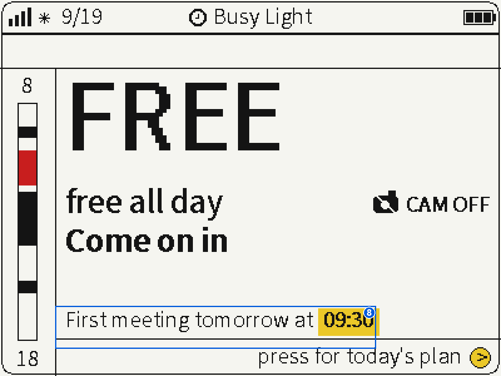

# Busy Light

This document records where the busy-light feature (office-door presence display) currently stands: the data contract, the two mock/bridge server implementations, and what's still not built.



*Idle/cam-off state after 17:00, showing the "First meeting tomorrow at 09:30" line above the footer hint.*

## Status

Contract-first, not backend-first — but the real backend is live now. `server/calendar_bridge.py` is a real bridge (`/calendar/today` against a calendar webhook, `/live` against Home Assistant sensors), verified end-to-end against the actual webhook/HA instance and confirmed on-device (default face correctly showing FREE/CAM OFF against an empty calendar and idle sensors). `kPresenceBridgeEndpoint` in `application.cc` doesn't distinguish mock from real — it's just whatever server happens to be running at that LAN IP/port, so switching between them is an operational choice (which server process is up), not a firmware change. `server/mock_presence_server.py` is kept around for offline dev/demo.

The firmware polls two endpoints, split because the data behind them changes at very different rates (see `firmware/main/common/presence_api.h`):

| Endpoint | Poll interval | Why |
| --- | --- | --- |
| `GET /calendar/today` | 20 min | Calendar events are near-static within a day |
| `GET /live` | 90s | In-call/webcam/presenting state can change second-to-second, but the e-paper panel takes 15-25s to refresh and locks out input during that, so sub-minute polling wouldn't be visibly faster |

Both are merged into a single `PresenceStatus` (`firmware/main/common/presence_types.h`) before reaching the renderer, so `firmware/main/ui/renderers/rawdraw/busy_light_renderer.cc` doesn't need to know about the split. On a fetch failure or a field missing from a response, the previous value for that field is kept (last-known-good) — a bad poll never blanks the display.

### Redraw behavior: polling is cheap, e-ink refresh is not

Every poll used to trigger an unconditional full-screen redraw, whether or not anything actually changed — and since the panel forces a hardware full refresh every 10 partial refreshes (`EpdRefreshScheduler`, `firmware/main/ui/epd_refresh.h`), that meant a 15-25s full refresh every 10 × 90s = 15 minutes, forever, even with an unchanging calendar and idle webcam. `BusyLightRenderer::Update()` (`busy_light_renderer.cc`) now compares the incoming status (plus time-derived state — which event is active/next, how many events have already ended, whether the 5pm tomorrow-line cutoff has passed) against what's actually on screen, and skips the redraw entirely when nothing visibly changed.

When something did change, the detail face (`View::kDetail`) can usually settle for a small dirty-rect refresh of just the header strip (swatch/word/camera icon, `{0, kHeaderTop, width, kHeaderHeight}`) instead of the whole panel, since the day grid below it doesn't read any AV state. The default/hallway face has no equivalent split — AV state feeds the band, headline word, human line, and presenting banner across most of the page — so any change there still redraws full-screen.

Net effect: polling frequency and screen-refresh cost are now decoupled. A poll that finds nothing new costs a small HTTP request and nothing else; only a poll that finds something new pays for a redraw, and only sometimes pays for a full one. One deliberate trade-off this introduces: the "now" position/past-event styling only updates on a poll boundary, same as before, not continuously.

## Contract: `GET /calendar/today`

```json
{
  "generated_at": "2026-09-16T11:46:33+00:00",
  "time_zone": "W. Europe Standard Time",
  "days": [
    {
      "date": "2026-09-16",
      "events": [
        {
          "start": "09:30",
          "end": "10:00",
          "title": "Daily Zeiss Angebot",
          "tier": "leadership",
          "participants": "[\"More than 10 participants\"]",
          "participant_count": "14"
        }
      ]
    },
    { "date": "2026-09-17", "events": [ ] }
  ]
}
```

Field reference:

| Field | Meaning |
| --- | --- |
| `generated_at` | Full ISO-8601 timestamp with UTC offset — a staleness marker, not used for event timing |
| `time_zone` | Informational only; the firmware doesn't parse it — the device's own RTC is already set to `Europe/Berlin` (see the clock/NTP setup), and `start`/`end` are plain local `HH:MM` |
| `days` | List of `{date, events}`. The firmware consumes two entries out of this list: the one whose `date` matches its own local date (falling back to `days[0]` if nothing matches — e.g. RTC not synced yet, or a TZ mismatch with the server — rather than rendering an empty page), and the one matching local date + 1 day ("tomorrow"), used only for the default face's end-of-workday footer line (see below). Unlike today, tomorrow has **no** `days[0]`-style fallback: if no entry matches tomorrow's date, the firmware treats that as "unknown" and keeps its previous last-known-good tomorrow summary rather than guessing "no meetings". Any further days beyond that are carried through but not read. |
| `events[].start` / `events[].end` | Local `"HH:MM"` strings, no timezone math needed on-device. The firmware skips any event where `end <= start` (e.g. an all-day placeholder like a birthday reminder encoded as `"02:00"`-`"02:00"`) so it can't be picked up as a real event or as "tomorrow's earliest meeting" — this is a defense-in-depth firmware-side filter; the backend is expected to not emit degenerate/all-day entries in the first place. |
| `events[].title` | Event title, shown as-is (or redacted to "Busy" by a bridge, before it ever leaves the source network) |
| `events[].tier` | One of `solo` / `internal` / `leadership` / `customer`. Drives the door-fill style on the detail-face day grid (outline / outline / yellow-rule / solid-red) and the "come in" / "knock" / "quiet" line on the default face. `solo` (no other attendees — e.g. "Lunch") currently renders identically to `internal`; it exists as a distinct tier for parity with the real feed, not because the renderer treats it specially yet. Unknown/missing tier defaults to `internal`, the least alarming reading. |

#### Day-grid block styling (detail face)

`TierColor()`/the tier `switch` in `DrawDetailFace()` only cover three visual fills — `solo` and unknown/missing tiers fall through the same `default:` case as `internal`, so all three read identically (a plain white box with a black outline). This is intentional, not a gap to "fix": there's no attendee-importance signal to distinguish `solo` from `internal` yet.

A **fourth**, separate visual state exists that's easy to mistake for a tier: any event whose `end_minutes` is already in the past (relative to render time) is rendered with `DrawStripeRect()` — a 1px-alternating black/white horizontal hatch — regardless of its tier, before the title text is drawn on top. Because the title is drawn in black, it disappears wherever it lands on a black stripe row, giving already-finished events a "struck-through"/hard-to-read look (e.g. "Standup" in the annotated screenshot in the Screenshots section below). This is deliberate — a glance at the grid should show what's already over without reading a single title — but it's a *time-based* override of the tier fill, not a fifth tier or a rendering bug in the `solo`/`internal` styling.

| Fill | Meaning |
| --- | --- |
| White box, black outline | `internal` or `solo` tier, still upcoming/in-progress |
| Yellow box, black outline, heavy black top/bottom rule | `leadership` tier, still upcoming/in-progress |
| Solid red box, black outline, white text | `customer` tier, still upcoming/in-progress |
| Black/white horizontal hatch, black outline | Event already ended (`end_minutes <= now_minutes`) — tier-independent, always wins over the tier fill |
| `events[].participants` | JSON-encoded **string** (not a nested array) — e.g. `"[\"Alice\",\"Bob\"]"` or `"[\"More than 10 participants\"]"`. Not yet read by the firmware. |
| `events[].participant_count` | Decimal **string**, not a number — e.g. `"14"`. Not yet read by the firmware. |

The `participants`/`participant_count` shape (string-encoded rather than a real array/number) mirrors exactly what the real Microsoft Graph-backed feed sends. The mock server and firmware parser intentionally don't "fix" it into a cleaner shape, so the mock never drifts from what a real bridge would actually have to produce.

Overlapping events (a real calendar can easily have two or three concurrent invites) are handled entirely in the renderer via a greedy 2-column layout with overflow summarized as "+N more" — the contract itself makes no attempt to pre-resolve overlaps or assign priority.

### Tomorrow footer line (default face)

Starting at 17:00 local time, the default face shows one extra line above the "press for today's plan" footer hint: `"First meeting tomorrow at HH:MM"` if tomorrow's day has at least one event, or `"No meetings tomorrow"` if it has none. Before 17:00, or if a fetch hasn't yet resolved a "tomorrow" day (see the `days` field reference above), the line is omitted entirely rather than showing a stale or guessed value. The "interesting" segment — the `HH:MM` time, or "No meetings" — sits in a bold yellow highlight chip sized to the actual text width (so a longer time like `10:30` isn't clipped), matching how importance is carried elsewhere on this page (tier fills, the presenting banner); the surrounding words stay plain weight so the chip is the only thing that draws the eye.

## Contract: `GET /live`

```json
{
  "updated_at": "2026-09-16T10:32:05+02:00",
  "isPresenting": false,
  "isInCall": false,
  "isWebcamActive": false
}
```

Straightforward booleans, no tiering. `isPresenting` (screen-share/do-not-disturb) takes priority in the renderer: it always colors the header band red regardless of calendar tier.

## Servers

Three independent implementations of the same contract, for three different purposes:

| Script | Purpose |
| --- | --- |
| `server/mock_presence_server.py` | Pure mock — returns hardcoded data on every request, edited by hand to try scenarios. No real backend queried. Used for firmware dev/testing; the generic Kconfig default (see below) points fresh checkouts at it. |
| `server/calendar_bridge.py` | Real bridge for both endpoints. `/calendar/today` is backed by a calendar webhook — URL and an `x-calendar-secret` header value are read from the `CALENDAR_SOURCE_URL`/`CALENDAR_SOURCE_SECRET` environment variables (never hardcoded, never logged, never committed). Deliberately source-agnostic: it only knows the webhook returns JSON already shaped like this contract, not what tool sits behind it. The upstream response is validated/rebuilt field-by-field rather than blindly proxied. `/live` is backed by Home Assistant: `isInCall`/`isWebcamActive` come from binary sensors (`HA_CALL_SENSOR`/`HA_WEBCAM_SENSOR`), `isPresenting` from comparing a text sensor's state (`HA_TEAMS_STATUS_SENSOR`) against `HA_PRESENTING_STATES`. All four entity IDs are configurable env vars since they depend on whatever publishes them into HA. Falls back to the "nothing going on" defaults if `HA_URL`/`HA_TOKEN` aren't set. |
| `server/presence_bridge.py` | Alternate all-HA sketch: same two binary sensors for call/webcam state as `calendar_bridge.py`, but also sources `/calendar/today` from HA's calendar API instead of a webhook. `tier` is derived from keyword lists matched against the event title (`HA_CUSTOMER_KEYWORDS`, `HA_LEADERSHIP_KEYWORDS`, `HA_SOLO_KEYWORDS`) since HA doesn't expose anything closer to "how important is this meeting" or attendee counts. Never deployed against a real HA instance as part of this project — treat it as a starting point, not a finished bridge. Superseded by `calendar_bridge.py` for setups that already have a calendar webhook. |

The firmware's bridge endpoint (`kPresenceBridgeEndpoint` in `firmware/main/application.cc`) is no longer a hardcoded constant — it's read from `CONFIG_PRESENCE_BRIDGE_ENDPOINT` (Kconfig menu "Deployment defaults" > "Presence/calendar bridge base URL", see `firmware/main/Kconfig.projbuild`). `sdkconfig` is gitignored, so each checkout/dev machine bakes in its own real value at build time; `sdkconfig.defaults.esp32s3` only carries a safe generic default (`http://192.168.178.37:8080`, i.e. `mock_presence_server.py` on a typical dev LAN) for fresh checkouts. The production device is built against `https://busylight.int.gaida.biz`, running `calendar_bridge.py` — a real DNS hostname works fine here since `esp_http_client` resolves it via the normal DNS resolver (this only needs to be a plain LAN IP if no public/LAN DNS entry exists for it; `.local`/mDNS names are the one thing that won't resolve, since no mDNS component is wired into this firmware).

Run the mock server for local dev:

```bash
python3 server/mock_presence_server.py --port 8080
```

Point a dev build at it by setting `CONFIG_PRESENCE_BRIDGE_ENDPOINT` via `idf.py menuconfig` (or editing `sdkconfig` directly), or at runtime via `presence_api_set_endpoint()`.

## Detail-face UP/DOWN scroll (built)

UP/DOWN on the detail face scroll the zoomed day-grid window an hour at a time, clamped to the day's 8:00-18:00 bounds; a press that's already at the clamp signals a no-op with a rapid double-blink on the onboard LED (`Board::FlashErrorLed()`) instead of the usual single activity-pulse blink. Resets to auto-centered-on-now whenever the view is toggled. On the default face (or everywhere, when `CONFIG_BUSY_LIGHT_DEBUG_CYCLE` is off), UP/DOWN remain a no-op.

## Screenshots

Captured on-device (4-color e-ink panel), default face unless noted otherwise.

| | |
| --- | --- |
|  **Busy** — internal-tier meeting in progress, "until HH:MM" line reflecting the active event. |  **Busy + presenting** — same as above with screen-share/do-not-disturb active, adding the "Presenting — do not disturb" banner. |
|  **Detail face** — zoomed day grid, header strip in sync with the current AV/tier state. |  **Busy, customer tier** — real (non-debug) calendar data, red band + presenting banner for a customer-tier meeting. |
|  **Detail face, colorful** — day grid showing a solid-red customer-tier block and a yellow-rule leadership-tier block. | |

### Detail-face layout callouts



Five non-overlapping regions make up `RenderDetailFace()`:

1. **Top-top bar** — the shared OS status chrome (signal, date, "Busy Light" title, battery), above `Style::kStatusBarHeight`; not drawn by this renderer.
2. **Top bar** — the tier word ("MEETING"/"FREE") plus the camera glyph/"CAM ON"/"CAM OFF" state (`kHeaderTop`/`kHeaderHeight`). The one region that can redraw on its own via a small dirty-rect refresh (see "Redraw behavior" above).
3. **Left side (time)** — the hour-of-day rail (`kLeftMargin`, 34px wide): hour labels, the dashed hour gridlines (mostly hidden under opaque event fills), and the now-marker flag. Scrolls with UP/DOWN (see "Detail-face UP/DOWN scroll" below).
4. **Calendar view** — the whole day-grid: every event block, colored/hatched per its tier or past/finished state. See "Day-grid block styling" above for what each fill (white outline, yellow + rule, solid red, black/white hatch) means.
5. **Bottom** — the "+N later" (and, scrolled the other way, "+N earlier") overflow label, summarizing events outside the zoomed window (here, "1 later"); an equivalent "+N more" pill (not pictured) can also appear when more than 2 events overlap the same time slot.

### Default-face layout callouts



Seven non-overlapping regions make up `RenderDefaultFace()` (the hallway view):

1. **OS status bar** — clock/signal/battery, shared chrome above `Style::kStatusBarHeight`, not drawn by the busy-light renderer itself.
2. **Color band** — full-width, red whenever `status.band_elevated` (leadership, customer, an ad-hoc call, or presenting), otherwise white; always reserves the same height so nothing else in the layout shifts.
3. **Day rail** — a full-day (`kHourStart`–`kHourEnd`, 8–18) mini timeline: a bracket/track with a black tick per calendar event (red only for `customer` tier — see `RailColor()`) and a black double-line "now" marker. Unlike the detail-face grid, it never shows titles/times, just shape.
4. **Headline word** — just "MEETING"/"FREE" itself, 3x the native font size (`DrawScaledText`, no larger Latin font asset exists in this build). The "until HH:MM"/"CAM OFF" line right below it is deliberately left unboxed here — it's minor enough not to need its own callout.
5. **Human line** — e.g. "Internal — come in", "Internal — important", "Customer", "Ad-hoc call"; the tier-carrying segment is colored red AND bold so it doesn't rely on color alone.
6. **Presenting banner** — yellow bar, shown only while screen-share/do-not-disturb is active (`current_.presenting`); when absent (as in a screenshot without it), the space below the human line is simply blank, not a missing element — see area 8 below for another thing that can occupy that same blank space.
7. **Footer hint + chevron** — "press for today's plan" plus a yellow circular chevron, hinting that BOOT opens the detail face.

An eighth region only appears conditionally, so it's shown separately:



8. **Tomorrow footer line** — from 17:00 local time onward, one extra line directly above the footer: `"First meeting tomorrow at HH:MM"` (with the time in a bold yellow highlight chip, as pictured) or `"No meetings tomorrow"`. Before 17:00, or if tomorrow's data hasn't resolved yet, this slot is simply omitted — it's independent of the presenting banner (area 6); both can appear at once if presenting is active after 17:00, stacked rather than overlapping.

## Not yet built

- `participants`/`participant_count` are carried in the contract but not surfaced anywhere in the UI.

## Status bar widget (shown on other pages)

While BusyLight is *not* the active page, `BusyLightRenderer` still
contributes a compact camera-state + MEETING/FREE word glimpse into the
shared OS status bar (in the gap between the clock/battery and the page
title) — see [`status-bar-widgets.md`](status-bar-widgets.md) for the
general mechanism and this widget's specifics.
