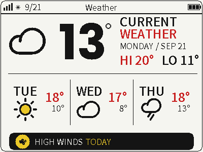

# Weather

This document records where the Weather module currently stands: the data
contract, the icon/alert mapping, configuration, and rendering notes.



## Status

Live and built. The firmware polls OpenWeatherMap's **One Call 3.0** endpoint
directly (no server-side bridge, unlike busy-light); `firmware/main/common/weather_api.h`/`.cc`
is the client, `firmware/main/ui/renderers/rawdraw/weather_renderer.cc` is the
renderer. On a fetch failure, the page falls back to a "no weather data /
long-press to refresh" placeholder rather than showing stale or blank data
indefinitely.

## Contract: OpenWeatherMap One Call 3.0

```
GET https://api.openweathermap.org/data/3.0/onecall
    ?lat={lat}&lon={lon}&appid={key}&units=metric|imperial&exclude=minutely,hourly
```

- `lat`/`lon` and the API key come from `CONFIG_WEATHER_LOCATION` /
  `CONFIG_WEATHER_API_KEY` (see Configuration below) — One Call 3.0 only
  accepts decimal-degree coordinates, not a free-form city name.
- `exclude=minutely,hourly` trims the response to just `current` + `daily[]`
  (8 days) + `alerts[]`, keeping it small (~5-8KB).
- `daily[0]` is today (hi/lo + one input to the heuristic alert scan);
  `daily[1..3]` become the three forecast cards. `alerts[]`, when present, is
  a real government/authority warning for the location and always takes
  priority over the heuristic (see Alerts below).

Fetched once at boot and every hour after that (`weather_api_init`'s timer);
`weather_api_fetch_now()` (wired to a long-press on the Weather page) can
trigger an out-of-band refresh on demand.

## Icon mapping

`WeatherIconForCode()` (`weather_api.h`/`.cc`) reduces OpenWeatherMap's ~50
condition IDs down to a 9-icon set. Icons are hand-converted from [Phosphor
Icons](https://phosphoricons.com) into three 1bpp bitmap fonts:
`weather_icons_v2_16` (alert badge), `weather_icons_v2_48` (forecast cards),
and `weather_icons_v2_76` (hero icon only — larger for more visual weight),
all sharing the same private-use codepoints `U+E000`-`U+E00B` (see
`components/78__xiaozhi-fonts/include/weather_icons.h`). Three icons
(`Sunny`, `PartlyCloudy`, `Thunder`) need a color accent and are split into
two glyphs — a solid "fill" shape (drawn first, in yellow) and an
outline/detail shape (drawn second, in black, on top); every other icon is a
single flattened glyph in plain black, sourced from single-path (non-duotone)
Phosphor "regular"-weight icons for a lighter, less "mushy" look at small
sizes.

| `WeatherIcon` | OWM condition ID range | Glyph (Phosphor) |
| --- | --- | --- |
| `Sunny` | 800 (clear) | `sun` (duotone) — solid yellow disc + black rays/ring outline (two-layer composite) |
| `PartlyCloudy` | 801, 802 (few/scattered clouds, ≤50% cover) | `cloud-sun` (duotone) — yellow sun peeking from behind a black-outline cloud (two-layer composite, faithful to the source art: the cloud itself is outline-only, not filled) |
| `Cloudy` | 803, 804 (broken/overcast clouds); fallback for 700s codes with no dedicated glyph (sand/dust whirls, squalls, tornado) | `cloud` (regular weight) — light outline-only cloud, single flat glyph |
| `Fog` | 701, 711, 721, 731, 741, 751, 761, 762 (mist/smoke/haze/dust/sand/ash) | `cloud-fog` (regular weight) — light outline cloud + horizontal fog lines |
| `Drizzle` | 300s | `cloud-rain` — same glyph as `Rain` |
| `Rain` | 500, 501, 520, 521, 531 (light/moderate rain, shower rain) | `cloud-rain` (regular weight) — outline cloud + rain streaks |
| `HeavyRain` | 502, 503, 504, 511, 522 (heavy/very heavy/extreme/freezing rain, heavy shower rain) | `umbrella` (duotone, flattened) — visually distinct from `Rain`/`Drizzle` |
| `Snow` | 600s | `cloud-snow` (regular weight) — outline cloud + snowflake dots |
| `Thunder` | 200s | `cloud-lightning` — solid black cloud (with the bolt-shaped area masked out of the outline layer) + a standalone yellow lightning bolt drawn on top (two-layer composite; see Rendering notes for how the bolt was isolated) |

Tornado (code 781) and sand/dust whirls/squalls still have no dedicated
glyph and remain in `Cloudy` — not distinct enough a case to justify another
icon yet.

## Alerts (bottom bar)

`WeatherAlertType` is evaluated fresh on every fetch, in this priority order:

1. **`kOfficial`** — a real alert is present in OWM's `alerts[]` for the
   location. Its headline (`event`, e.g. "Gale Force Gusts") is keyword-matched
   (`ClassifyOfficialAlertIcon()`) into rain/snow/wind/heat so the existing
   icon set still applies, and the alert bar shows the actual official
   headline text uppercased instead of a canned message.
2. **Heuristic**, only if no official alert is active — scanned across today
   + the 3-day forecast, first match wins in this order: rain > snow > wind >
   heat.

| Type | Trigger | Bar message |
| --- | --- | --- |
| `kRain` | OWM `pop` (precipitation probability) ≥ 40% on a rain/thunder day | "TAKE AN UMBRELLA \<DAY\>" |
| `kSnow` | `pop` ≥ 40% on a snow day | "SNOW EXPECTED \<DAY\>" |
| `kWind` | `wind_speed` ≥ 40 kph (metric) / 25 mph (imperial) — roughly Beaufort 6 | "HIGH WINDS \<DAY\>" |
| `kHeat` | daily max temp ≥ 30°C / 86°F | "HEAT WARNING \<DAY\>" |
| `kNone` | nothing above triggers | "NO WEATHER ALERTS TODAY" |

`<DAY>` is "TODAY" or the upper-case weekday the condition was found on.
Thresholds live in `weather_api.cc` (`kRainChanceThresholdPct`,
`kWindThresholdKph`/`kWindThresholdMph`, `kHeatThresholdC`/`kHeatThresholdF`)
if they turn out too chatty/quiet in practice.

The bar itself is always visible, but its style depends on `alert.type`:

| State | Background | Icon | Text |
| --- | --- | --- | --- |
| Active (any type but `kNone`) | Black | Yellow filled-circle badge behind a black icon glyph — wind uses a dedicated `weather_icons_v2_16` "wind" glyph (`U+E00B`, a thin single-path/non-duotone Phosphor `wind` icon — the duotone version read "mushy" at 16px; no wind icon exists in the plain condition-code mapping) | White, with the day-word suffix in yellow |
| Inactive (`kNone`) | White, thin black border | None | Normal text color, "NO WEATHER ALERTS TODAY" |

## Configuration

Set via `idf.py menuconfig` → "Deployment defaults", or by editing `sdkconfig`
directly (gitignored — never commit a real key/location to
`sdkconfig.defaults.esp32s3`):

| Kconfig option | Meaning | Default |
| --- | --- | --- |
| `CONFIG_WEATHER_API_KEY` | OpenWeatherMap API key ([sign up](https://home.openweathermap.org/users/sign_up) — One Call 3.0 needs a payment method on file but includes a free monthly call allowance) | `""` (empty = module shows "no weather data" placeholder) |
| `CONFIG_WEATHER_LOCATION` | `"lat,lon"` decimal degrees (look up coordinates at [openweathermap.org/find](https://openweathermap.org/find) or any map service) | `"53.5511,9.9937"` (Hamburg, Germany) |
| `CONFIG_WEATHER_UNITS_CELSIUS` / `CONFIG_WEATHER_UNITS_FAHRENHEIT` | Temperature unit shown on the page — build-time only, no on-device toggle yet | Celsius |

## Rendering notes

- **Hero number**: drawn with `font_hero_digits_96`, a dedicated digits-only
  (`0-9`, `-`) 1bpp bitmap font generated from Poppins Bold via
  `lv_font_conv` (`components/78__xiaozhi-fonts/src/font_hero_digits_96.c`).
  All fonts on this display are 1bpp (no anti-aliasing in the `DrawText`
  renderer), so a font originally designed for large digits reads far
  cleaner than repurposing a small UI icon font. The degree mark is a small
  drawn ring (no "°" glyph in the big-digit font) placed just 3px past the
  last digit so it reads as attached to the number rather than floating.
- **Hero icon size**: the hero icon uses its own larger font,
  `weather_icons_v2_76` (76px design size vs. 48px for forecast cards),
  generated by the same conversion pipeline at a different rasterization
  size. It's not a scaled bitmap — every glyph was re-rasterized and
  re-cropped at 76px for crisper edges than upscaling the 48px set would
  give.
- **Sun icon contrast**: yellow ink alone has low contrast against the white
  panel background, so `Sunny` and `PartlyCloudy` are two-layer composites —
  a solid yellow "fill" glyph drawn first, then a black outline/detail glyph
  drawn on top at the *same* pen position (both glyphs were cropped from
  identical 256x256 source canvases before conversion, so their baked-in
  offsets already line up).
- **Partly cloudy**: uses Phosphor's real duotone `cloud-sun` art as-is — the
  cloud in that icon is intentionally outline-only (not filled), with the sun
  as the only solid/colored shape. This matches the source icon faithfully;
  it can be changed to a filled-black cloud instead if that reads better on
  device.
- **Lightning bolt color**: Phosphor's `cloud-lightning` outline path draws
  the cloud contour and the bolt as one continuous shape (they share an
  edge), so there's no clean vector split between them. Instead, the bolt
  was isolated with a pixel-space crop: after rasterizing the outline layer,
  any "ink" pixel that falls inside a fixed bounding box roughly matching
  where the bolt sits (bottom-center of the icon) is drawn in yellow as a
  separate glyph, and excluded from the black cloud-outline glyph. This is a
  one-off heuristic tuned by eye for this specific icon, not a general
  technique.
- **Icon conversion pipeline**: the Phosphor SVGs were split into per-layer
  path fragments (or used as a single flat path for regular-weight icons),
  rasterized with Inkscape, thresholded/bit-packed with Pillow, and
  hand-emitted as `lv_font_fmt_txt` C structures mirroring
  `weather_icons_48.c`'s format, at three sizes (16/48/76px). The conversion
  scripts aren't checked into the repo; ask if they need regenerating.
- **Layout**: icon + big temperature sit side-by-side on the left, both
  vertically centered on the same horizontal band; "CURRENT WEATHER" (two
  lines), the date, and HI/LO sit on the right, also centered on that band.
  The divider line position is derived from whichever block (icon or
  heading/date/hi-lo) runs lower, so it never crowds the HI/LO line
  regardless of font metrics.
- **Forecast cards**: day label (bold) + icon on the left, HI (red) / LO
  stacked on the right, per card.

## Status bar widget (shown on other pages)

While Weather is *not* the active page, `WeatherRenderer` still contributes
a compact icon + temperature glimpse into the shared OS status bar (in the
gap between the clock/battery and the page title) — see
[`status-bar-widgets.md`](status-bar-widgets.md) for the general mechanism
and this widget's specifics.
